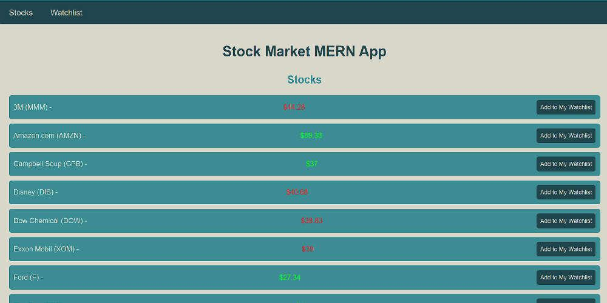

# 📈 Stock Market Portfolio App (MERN Stack)

A web application that helps efficiently **manage and track stock market investments and portfolios** using the **MERN (MongoDB, Express, React, Node.js) stack**.



## 🚀 Features
- **View all stocks** available in the database.
- **Add stocks manually** via API requests.
- **Watchlist functionality** – Save favorite stocks for quick access.
- **Dynamic price indicator** – Green when increasing, red when decreasing.
- **User-friendly UI** built with **React** and styled components.

## 🛠️ Prerequisites
Make sure you have the following installed:
- [Node.js](https://nodejs.org/en/download/) & npm
- [MongoDB](https://www.mongodb.com/try/download/community) (or [MongoDB Atlas](https://www.mongodb.com/atlas))
- React
- Express
- MERN Stack setup

## 📌 Project Setup
### Backend (Node.js + Express)
1. Clone the repository:
   ```bash
   git clone https://github.com/your-repo/stock-market-portfolio.git
   cd stock-market-portfolio
   ```

2. Install dependencies:
   ```bash
   npm install
   ```

3. Start the backend server:
   ```bash
   npm run start
   ```

### Frontend (React)
1. Navigate to frontend folder:
   ```bash
   cd stock-market-frontend
   ```

2. Install dependencies:
   ```bash
   npm install axios
   ```

3. Run the React app:
   ```bash
   npm start
   ```

## 🗄️ Database Setup (MongoDB)
- Use **MongoDB Compass** or **Atlas** to create a database and insert stock data.
- You can use the sample JSON file provided:
  ```json
  "https://gist.github.com/stevekinney/f96d5800852e91282f46#file-stocks-json"
  ```
- Run:
  ```bash
  mongoimport --jsonArray --db stockDB --collection stocks --file path/to/stocks.json
  ```

## 🔗 API Endpoints
| Method | Endpoint          | Description |
|--------|------------------|-------------|
| GET    | `/api/stocks`    | Fetch all stocks |
| POST   | `/api/watchlist` | Add stock to watchlist |

## 🎨 UI Overview
- **Stocks List:** View all available stocks with price status.
- **Watchlist:** View saved stocks.
- **Responsive Design:** Works well on all devices.
